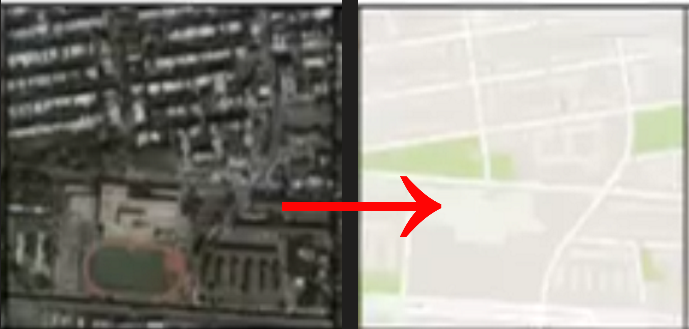

## Pix2Pix Model for Satellite Images Segmentation

This project utilizes the Pix2Pix GAN (Generative Adversarial Network) model to transform satellite images into segmented map representations. The model performs image-to-image translation, converting satellite photos into simplified, annotated maps

The generator in this project uses a U-Net architecture, which is ideal for capturing both global context and fine details in image segmentation tasks. The discriminator employs PatchGAN, focusing on classifying image patches rather than the entire image, enabling sharper and more realistic output.
